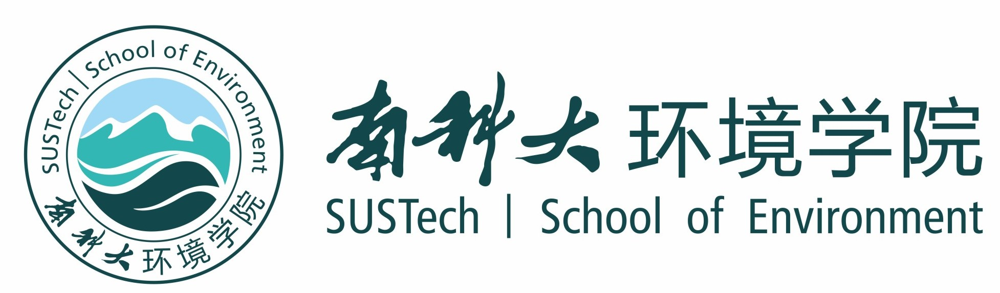

### 课程简介

环境科学的研究对象多是受诸多复杂因素影响的随机现象，数理统计方法是研究这些随机现象的有效手段之一。

本课程从应用角度出发，结合研究实例，系统阐述经典数理统计方法。教学以随机变量的基本特征为主线，阐述关于变量大小、离散和分布特征的描述和检验。具体内容包括：数据预处理、总体特征表征、大小比较的假设检验、离散程度比较的假设检验、分布检验、方差分析和回归分析。

本课程与其它统计课程的最大区别在于，本课程不注重统计方法的导出过程，而是**特别强调具体方法的应用前提和基本要求，强调如何正确使用相应的统计方法**。

### 授课教授

陶澍院士，1950年生，江苏省无锡市人， 1977年毕业于北京大学地质地理系，1981年、1984年获美国堪萨斯大学硕士、博士学位。2009年当选为中国科学院地学部院士。

1984年至2020年在北京大学工作。现为南方科技大学环境科学与工程学院讲席教授。曾主持国家自然杰出青年基金（1995）、创新研究群体（2000）和包括面上、重点、重大和重大国际合作在内的多项自然科学基金及科技部和生态环境部研究项目。目前兼任国家环境生态咨询委员会委员、国家环境与健康专家咨询委员会委员、*Environmental Science & Technology*副主编及多个国内外刊物主编、副主编和编委等。

主要从事微量有毒污染物排放、行为、归趋和效应等区域尺度环境过程的研究。目前重点包括全球污染物排放清单、污染物迁移和暴露模拟以及农村生活源污染物生成和对室内外空气质量及健康影响等。在国际学术期刊发表第一或通讯作者论文200余篇。Web of Science引用超过两万次，H指数80。陶澍院士在2020年荣获了北京大学教学成就奖。

### 教材

应用数理统计方法, 陶澍, 中国环境科学出版社, 1994, 433页 [下载链接](https://zhu-group.github.io/ams/download/应用数理统计方法_陶澍-清晰版.pdf)

