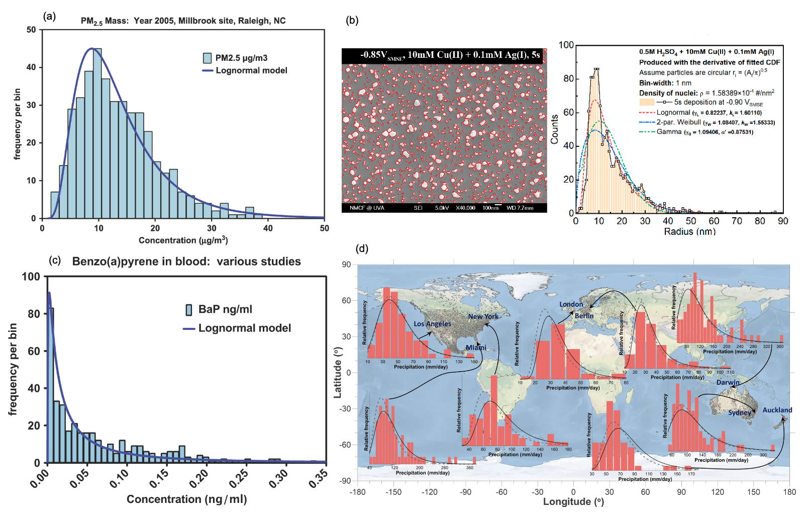

## Q1. 现实中许多现象呈正态分布或对数正态分布，呈现这种分布的原因是什么？

### 1.1. 理论依据：中心极限定理 (Central Limit Theorem, CLT)
这是目前讨论较多的解释。[(stack exchange)](https://stats.stackexchange.com/questions/204471/is-there-an-explanation-for-why-there-are-so-many-natural-phenomena-that-follow) [(reddit)](https://www.reddit.com/r/AskStatistics/comments/ui6hc3/why_do_many_things_in_nature_adhere_to_the/)

* **核心逻辑：** 如果一个随机变量是由大量相互独立同分布的随机因素共同作用的结果，其最终分布形态取决于这些因素是如何“组合”在一起的。
* **加法组合 $\rightarrow$ 正态分布**
* **乘法组合 $\rightarrow$ 对数正态分布**

---

### 1.2. 正态分布 (Normal Distribution)

**可能原因：加法效应 (Additive Effect)**
变量由大量独立、微小的随机因素**累加**而成。即 $X = \xi_1 + \xi_2 + \dots + \xi_n$。在这种模式下，每个因素对结果的影响是绝对数值的叠加，且通常围绕一个中心值上下波动，正负波动相互抵消，最终在均值附近形成对称分布。

**典型现象与物理机制：**

  

Fig1. Examples of phenomenons that are tend to follow normal distribution

  * **生物特征：** 同一发育阶段、同一生境下生物个体的形态指标（如体长、体重）。比如人的身高受大量相互独立的基因位点及微小环境因素（如每日摄食量的随机波动、气温、湿度等）共同影响，这些因素的效果在个体生长过程中不断**累加**，使体长趋于均值，分布呈正态分布；[Fig1(a) U.S. CDC Adult Height](https://www2.census.gov/library/publications/2010/compendia/statab/130ed/tables/11s0205.pdf)
  *  **物理量波动：** 相对稳定的环境背景下，气压、气温在短期内的随机波动。比如气温的波动是由于无数微小的能量交换过程（辐射、对流、平流）随机**叠加**形成的。这种基于能量守恒的“加总”过程，使得波动量呈现中间高、两边对称的钟形分布。[Fig1(b) NASA. 2021](https://svs.gsfc.nasa.gov/4891/)

---

### 1.3. 对数正态分布

**可能原因：乘法效应 (Multiplicative Effect)/比例增长**
变量的变化是由许多相互依赖的随机因素**连乘**（或按比例变化）的结果。 即 $Y = \xi_1 \times \xi_2 \times \dots \times \xi_n$。 对等式两边取对数后：$\ln Y = \sum \ln \xi_i$。根据 CLT，$\ln Y$ 符合正态分布，因此原始值 $Y$ 呈显著右偏的对数正态分布（存在极少数极高值）。

**常见现象：**

  

Fig 2. Examples of phenomenons that are tend to follow lognormal distribution	

* **污染物浓度：** 大气中的 PM2.5 浓度、土壤中的重金属含量、水体中的有机污染物浓度。以PM2.5浓度为例，污染物从源排放开始，经历了稀释、扩散、沉降、化学转化等多个过程。每个过程通常是以**百分比（速率系数）**的形式作用于前一个阶段的浓度，这种“连乘效应”导致极少数高浓度值形成右偏。[Fig2(a) Joachim D. Pleil, et al. JTEH. 2014](https://www.tandfonline.com/doi/full/10.1080/10937404.2014.956854#d1e407)

* **颗粒物粒径：** 气溶胶或纳米颗粒等粒径分布。颗粒生长是通过成核、碰撞、积聚等过程实现的，其增长速率往往与颗粒现有的表面积或体积成正比（即**比例增长**），这种比例连乘导致粒径分布呈对数正态分布。[Fig2(b) Yunkai Sun, et al. Materials. 2023](https://www.mdpi.com/1996-1944/16/19/6452)

* **生物暴露剂量：** 人体通过呼吸或饮食摄入的化学物质总量。如 BaP 在血液中的浓度，污染物进入体内后，经过吸收、分布、代谢、排泄（ADME）等多个动力学环节，每个环节都对应一个**转移份额或分数**，多阶段的分数连乘决定了最终血液中的残留水平[Fig2(c) Joachim D. Pleil, et al. JTEH. 2014](https://www.tandfonline.com/doi/full/10.1080/10937404.2014.956854#d1e407)

* **水文特征：** 降雨强度、河流径流量。比如降雨是由水汽供应、上升气流强度、凝结效率等多个物理因子共同决定的，这些因子之间通常是**比例耦合（乘法关系）**而非简单的数量加和，从而产生对数正态分布。[Fig2(d) Leroy J. Bird, et al. CEE. 2023](https://www.nature.com/articles/s43247-023-01142-4)

---

### 1.4. 对比总结表

| 特性 | 正态分布 | 对数正态分布 |
| :--- | :--- | :--- |
| **数学原型** | **加法效应**（各因素相互叠加） | **乘法效应**（各阶段相互依赖连乘） |
| **物理机制** | 围绕稳态的**随机波动** | 涉及阶段性的**比例增长/稀释** |
| **数据特征** | 关于均值完全对称，无偏 | 显著右偏，具有“长尾”特征 |
| **典型指标** | 广度量（质量、长度）的测量误差、波动 | 强度量（浓度、速率） |

---

## Q2. AI 时代为什么还要学这门课？

在 AI 大语言模型可以一键生成代码和结果的今天，学习《应用数理统计》的意义已经从**“如何计算”**转向了**“如何判断”**。

---

### 2.1. AI 负责计算，你负责“前提”
AI 可以帮你执行复杂的统计检验，但它往往不会检查数据的**适用前提**。本课程不重推导，而重**应用前提**。只有理解了数据背后的分布逻辑，你才能在 AI 给出结果时进行有效判别：“前提不对，结果无效”。如果你把一组服从对数正态分布的污染物浓度数据喂给 AI 跑 T 检验，它会顺从地给你一个显著性 P 值，即使这个操作在统计学上是错误的，因为你需要先做对数变换。

### 2.2. 统计思维是数据科学的基石

AI模型本质上是建立在统计框架之上的。许多先进算法的核心思想源于经典统计。不理解统计中的**变异、分布、假设检验、置信区间**等概念，就很难真正理解模型在“学习”什么，更难以评估其结果的可靠性。

### 2.3. 防止“垃圾进，垃圾出” (Garbage In, Garbage Out)
本课程强调的**数据预处理、异常值识别、分布检验**等内容，是保证输入数据质量的关键步骤。没有经过恰当统计描述和清洗的数据，直接投入AI模型，很可能导致误导性甚至错误的结论。

---

**总结：**

AI 主要解决了**“怎么算”**的问题，而这门课解决的是：   

* 1. **能不能算？**（前提条件是否满足） 
* 2. **用哪个算？**（模型选择是否科学）    
* 3. **结果信不信？**（物理意义解释是否合理）  
